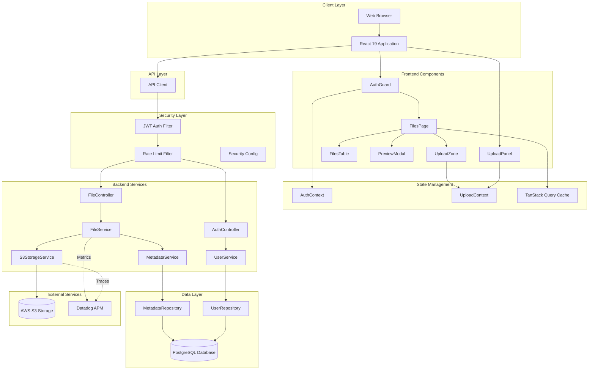
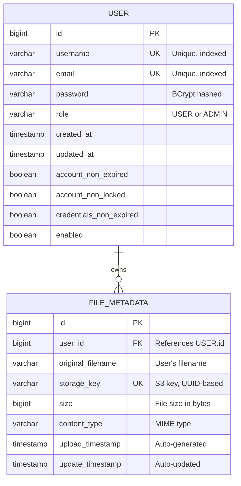
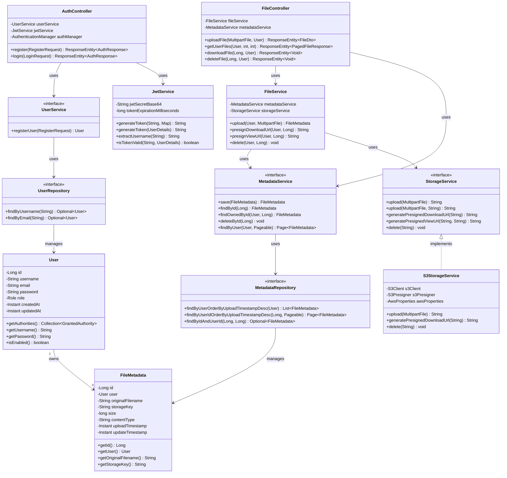

# File Storage System

This is a production-ready file storage application that keeps your files secure in S3. It comes with JWT authentication to protect your data and comprehensive monitoring so you know what's happening under the hood.

**Stack:** Spring Boot 3.2 (Java 21) + React 19 + PostgreSQL + AWS S3 + Docker  
**Status:** Production-Ready & Fully Dockerized

---

## Features

- **Secure Authentication:** JWT-based auth with BCrypt password hashing
- **File Operations:** Upload, download, preview, delete with drag-and-drop
- **Cloud Storage:** AWS S3 backend with presigned URLs
- **Rich Previews:** Images, PDFs, text files, videos, and audio
- **User Isolation:** Every file is private to its owner
- **Rate Limiting:** Protect against abuse with configurable limits
- **Observability:** OpenTelemetry metrics exported to Datadog APM for full-stack monitoring
- **Production Security:** HTTPS, HTTP/3 support, CSP, security headers, and hardened containers
- **Modern Protocols:** HTTP/3 with QUIC for improved performance and reduced latency

---

## Quick Start

### Prerequisites

- Docker & Docker Compose
- AWS account with S3 bucket (or use LocalStack for testing)

### One-Command Deployment

```bash
./docker-up.sh
```

This script will:
1. Generate secure secrets (JWT, database password)
2. Build all Docker images (backend, frontend, database)
3. Start all services with health checks
4. Create a demo user account

**Access the application:**
- **Frontend:** http://localhost:3000
- **Backend API:** http://localhost:8080/api
- **API Docs:** http://localhost:8080/swagger-ui.html
- **Database:** localhost:5433 (PostgreSQL)

**Default Credentials:**
- Username: `demouser`
- Password: `Demo123!`

---

## System Architecture

### Component Diagram



### Entity-Relationship Diagram



### UML Class Diagram



---

## Technology Stack

### Backend
- **Framework:** Spring Boot 3.2.2
- **Language:** Java 21 (LTS)
- **Database:** PostgreSQL 17
- **ORM:** Spring Data JPA (Hibernate)
- **Security:** Spring Security + JWT
- **Storage:** AWS S3 SDK
- **Observability:** Micrometer + OpenTelemetry (OTLP) → Datadog APM
- **Build Tool:** Gradle 8.5

### Frontend
- **Framework:** React 19
- **Language:** TypeScript 5.3
- **Build Tool:** Vite 5
- **State Management:** TanStack Query v5
- **Styling:** Tailwind CSS 3
- **HTTP Client:** Fetch API with custom wrapper
- **Testing:** Playwright (E2E), Vitest (unit)

### Infrastructure
- **Containerization:** Docker + Docker Compose
- **Web Server:** Nginx with HTTP/2 and HTTP/3 (QUIC) support
- **Deployment:** AWS EC2 (production) or local Docker
- **DNS:** DuckDNS (free dynamic DNS)
- **SSL:** Let's Encrypt (Certbot)

---

## Project Structure

```
File-System/
├── src/                          # Backend (Spring Boot)
│   └── main/java/org/ddamme/
│       ├── controller/           # REST API endpoints
│       ├── service/              # Business logic
│       ├── database/             # JPA entities & repositories
│       ├── security/             # JWT, filters, rate limiting
│       ├── dto/                  # Data transfer objects
│       └── exception/            # Custom exceptions
├── client/                       # Frontend (React)
│   ├── src/
│   │   ├── components/           # React components
│   │   ├── pages/                # Page components
│   │   ├── hooks/                # Custom React hooks
│   │   ├── contexts/             # React contexts
│   │   └── api/                  # API client
│   └── public/                   # Static assets
├── deployment/                   # Production configs
│   └── nginx/                    # Nginx reverse proxy config
├── docs/                         # Architecture documentation
├── .secrets/                     # Secret files (git-ignored)
├── docker-compose.yml            # Multi-container orchestration
├── Dockerfile                    # Backend container image
└── docker-up.sh                  # One-command startup script
```

---

## Security Features

This application addresses multiple vulnerabilities from the **OWASP Top 10 2021**:

### OWASP Top 10 2021 Coverage

#### A01:2021 – Broken Access Control ✅
- **User Isolation:** All file operations verify ownership through JPA queries with user context
- **Authorization Checks:** Every API endpoint validates the authenticated user owns the resource
- **JWT Authentication:** Token-based auth with 24-hour expiration prevents session hijacking

#### A02:2021 – Cryptographic Failures ✅
- **BCrypt Password Hashing:** All passwords hashed with strength 12 (2^12 iterations)
- **TLS 1.2/1.3 Only:** HTTPS enforced in production with strong cipher suites
- **Secure Secrets Management:** JWT secrets and credentials stored in Docker secrets, never in code
- **HSTS Enabled:** Strict-Transport-Security headers prevent downgrade attacks

#### A03:2021 – Injection ✅
- **SQL Injection Protection:** JPA with parameterized queries (no raw SQL)
- **Input Validation:** Bean Validation annotations (@NotBlank, @Email, @Size) on all DTOs
- **Content-Type Validation:** Strict MIME type checking on file uploads

#### A04:2021 – Insecure Design ✅
- **Rate Limiting:** Bucket4j-based rate limiting per route (login, upload, API)
- **Principle of Least Privilege:** Non-root containers with dropped capabilities
- **Fail-Safe Defaults:** Deny-by-default security configuration

#### A05:2021 – Security Misconfiguration ✅
- **Security Headers:** CSP, X-Frame-Options, X-Content-Type-Options, Referrer-Policy
- **CORS Configuration:** Strict origin validation, no wildcard origins
- **Error Handling:** Generic error messages to external users, detailed logs internally
- **Server Hardening:** Nginx server tokens disabled, unnecessary headers removed

#### A07:2021 – Identification and Authentication Failures ✅
- **Strong Password Policy:** Minimum 8 characters with complexity requirements
- **JWT Best Practices:** HS256 signing, short expiration, secure secret rotation support
- **Auto-Logout:** Frontend automatically logs out on 401 responses
- **No Default Credentials:** Demo user only for local testing, disabled in production

#### A08:2021 – Software and Data Integrity Failures ✅
- **Dependency Management:** Gradle dependency verification, regular updates
- **Container Image Integrity:** Multi-stage Docker builds with pinned base images
- **Audit Logging:** All security events logged with correlation IDs

#### A09:2021 – Security Logging and Monitoring Failures ✅
- **Comprehensive Logging:** Request correlation IDs, structured JSON logs (Logback)
- **OpenTelemetry Integration:** Metrics and traces exported to Datadog via OTLP
- **Business Metrics:** Upload/download counts, rate limit hits, auth failures
- **Real-Time Monitoring:** Datadog APM dashboards for HTTP latency, error rates, JVM metrics

#### A10:2021 – Server-Side Request Forgery (SSRF) ✅
- **No User-Controlled URLs:** S3 presigned URLs generated server-side only
- **Input Validation:** All external inputs validated before processing
- **Network Segmentation:** Backend isolated from public internet in Docker network

### Authentication & Authorization
- JWT tokens with 24-hour expiration
- BCrypt password hashing (strength 12)
- User isolation (files are private to owner)
- Auto-logout on token expiration

### API Security
- Rate limiting (Bucket4j + Caffeine cache)
- CORS configuration
- Request correlation IDs
- Audit logging for security events

### Container Security
- Read-only filesystems
- Dropped capabilities
- Non-root users
- Security profiles (no-new-privileges)

### Frontend Security
- Content Security Policy (CSP)
- Sandboxed iframes for previews
- Referrer policy (no S3 URL leaking)
- HTTPS enforcement in production

---

## Deployment Options

### Option 1: Local Development (Docker Compose)

```bash
# Start all services
./docker-up.sh

# Or manually
docker-compose up -d

# View logs
docker-compose logs -f

# Stop all services
docker-compose down
```

### Option 2: Production on AWS EC2

See deployment guides in `docs/` directory for complete instructions.

**High-level steps:**
1. Launch EC2 instance (t3.medium recommended)
2. Install Docker & Docker Compose
3. Setup DuckDNS domain
4. Clone repository and configure secrets
5. Deploy with `docker-compose up -d`
6. Setup Nginx reverse proxy
7. Install SSL certificate (Let's Encrypt)

**Estimated Cost:** ~$43/month (EC2 + S3 + data transfer)

---

## Testing

### Backend Tests
```bash
./gradlew test
```

### Frontend E2E Tests
```bash
cd client
npm run test:e2e          # Headless
npm run test:e2e:ui       # With UI
```

### Frontend Unit Tests
```bash
cd client
npm run test
```

---

## Monitoring

### OpenTelemetry + Datadog Integration

The application uses **OpenTelemetry (OTLP)** to export metrics and traces to **Datadog APM** for production monitoring. All metrics are collected via Micrometer and sent through the Datadog agent's OTLP endpoints.

**Metrics Tracked:**
- **HTTP Metrics:** Request rates, latency (p95/p99), error rates by endpoint
- **Database Performance:** Query execution time, connection pool stats
- **S3 Operations:** Upload/download metrics, presigned URL generation time
- **JVM Metrics:** Heap usage, GC pause time, thread counts (via Datadog profiling)
- **Business Metrics:** File upload bytes distribution, success/failure counters
- **Rate Limiting:** Rate limit rejections by route

**Architecture:**
- **Backend:** Spring Boot → Micrometer → OTLP exporter → Datadog agent (port 4318)
- **Agent:** Datadog agent receives OTLP and forwards to Datadog cloud
- **100% OTLP:** No legacy StatsD - fully modern OpenTelemetry pipeline

**Setup:**
1. Sign up for Datadog (free trial available)
2. Add API key to `.secrets/dd_api_key`
3. Set Datadog site to `.secrets/dd_site` (e.g., `datadoghq.com`)
4. Restart services with `docker-compose up -d`

**Configuration:**
```yaml
# Backend exports metrics via OTLP
management.otlp.metrics.export.url: http://datadog:4318/v1/metrics

# Datadog agent receives OTLP and forwards to cloud
DD_OTLP_CONFIG_RECEIVER_PROTOCOLS_HTTP_ENDPOINT: "0.0.0.0:4318"
DD_PROFILING_ENABLED: "true"
DD_RUNTIME_METRICS_ENABLED: "false"  # Using OTLP instead of StatsD
```

**Remove Datadog:**
If you don't need monitoring, comment out the `datadog` service in `docker-compose.yml` and remove the `MANAGEMENT_OTLP_METRICS_EXPORT_URL` environment variable from the `app` service.

---

## Configuration

### Environment Variables

**Backend:**
- `SPRING_DATASOURCE_URL` - PostgreSQL connection string
- `AWS_S3_BUCKET_NAME` - S3 bucket name
- `AWS_REGION` - AWS region (default: us-east-1)
- `SECURITY_JWT_SECRET` - JWT signing secret (base64)
- `SPRING_PROFILES_ACTIVE` - Active profile (dev/prod)

**Frontend:**
- Configured via `vite.config.ts`
- API URL: `http://localhost:8080` (dev), reverse-proxied in production

### Secret Files

Located in `.secrets/` directory (git-ignored):
- `db_password` - PostgreSQL password
- `jwt_secret` - JWT signing secret (base64-encoded)
- `aws_access_key_id` - AWS access key (or use IAM role)
- `aws_secret_access_key` - AWS secret key (or use IAM role)
- `dd_api_key` - Datadog API key (optional)
- `dd_site` - Datadog site (optional)

**Generate secrets:**
```bash
# Database password
openssl rand -base64 32 > .secrets/db_password

# JWT secret (256-bit)
openssl rand -base64 32 > .secrets/jwt_secret
```

---

## Troubleshooting

### Backend won't start
```bash
# Check logs
docker-compose logs app

# Verify secrets exist
ls -la .secrets/

# Rebuild if needed
docker-compose build app
```

### Frontend shows 401 errors
- Check that backend is running on port 8080
- Verify JWT token in browser localStorage
- Check browser console for CORS errors

### Files won't upload
- Verify S3 bucket exists and is accessible
- Check AWS credentials in `.secrets/`
- Ensure file size is under 10MB limit
- Review backend logs: `docker-compose logs app`

### Database connection failed
- Check PostgreSQL is running: `docker-compose ps`
- Verify password in `.secrets/db_password`
- Check connection string in environment

---

## Performance

**Benchmarks from Datadog(t3.small EC2):**
- File upload (1MB): ~500ms
- File list (20 items): ~30ms
- File download (presigned URL generation): ~20ms

## License

This project is licensed under the MIT License - see the [LICENSE](LICENSE) file for details.

---

**Built with Spring Boot, React, and AWS**
