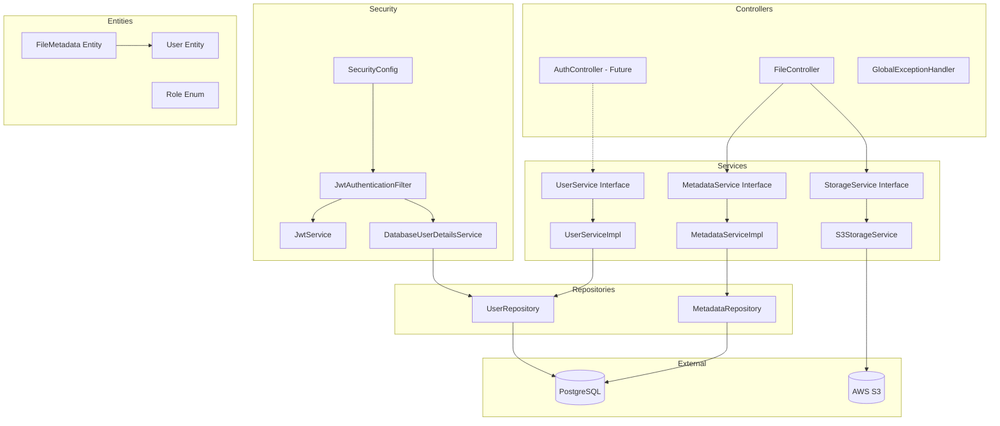
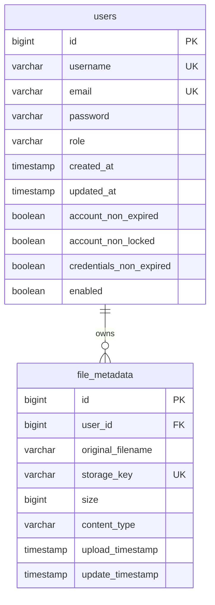
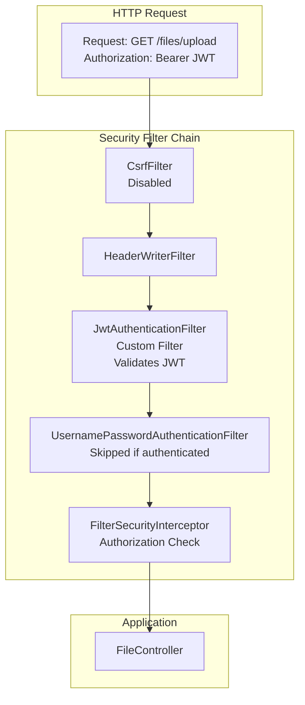

# File System Application Architecture

## 1. Application Architecture Overview

```mermaid
graph TB
    subgraph "Controllers"
        FC[FileController]
        AC[AuthController - Future]
        GEH[GlobalExceptionHandler]
    end

    subgraph "Security"
        SC[SecurityConfig]
        JAF[JwtAuthenticationFilter]
        JS[JwtService]
        DUDS[DatabaseUserDetailsService]
    end

    subgraph "Services"
        US[UserService Interface]
        USI[UserServiceImpl]
        MS[MetadataService Interface]
        MSI[MetadataServiceImpl]
        SS[StorageService Interface]
        S3S[S3StorageService]
    end

    subgraph "Repositories"
        UR[UserRepository]
        MR[MetadataRepository]
    end

    subgraph "Entities"
        U[User Entity]
        FM[FileMetadata Entity]
        R[Role Enum]
    end

    subgraph "External"
        DB[(PostgreSQL)]
        S3[(AWS S3)]
    end

    FC --> MS
    FC --> SS
    AC -.-> US
    
    SC --> JAF
    JAF --> JS
    JAF --> DUDS
    DUDS --> UR

    USI --> UR
    MSI --> MR
    S3S --> S3

    US --> USI
    MS --> MSI
    SS --> S3S

    FM --> U
    UR --> DB
    MR --> DB
```

## 2. Database Schema (ERD)

```mermaid
erDiagram
    users {
        bigint id PK
        varchar username UK
        varchar email UK
        varchar password
        varchar role
        timestamp created_at
        timestamp updated_at
        boolean account_non_expired
        boolean account_non_locked
        boolean credentials_non_expired
        boolean enabled
    }

    file_metadata {
        bigint id PK
        bigint user_id FK
        varchar original_filename
        varchar storage_key UK
        bigint size
        varchar content_type
        timestamp upload_timestamp
        timestamp update_timestamp
    }

    users ||--o{ file_metadata : owns
```

## 3. Spring Security Filter Chain

```mermaid
graph TD
    subgraph "HTTP Request"
        A[Request: GET /files/upload<br/>Authorization: Bearer JWT]
    end

    subgraph "Security Filter Chain"
        B[CsrfFilter<br/>Disabled]
        C[HeaderWriterFilter]
        D[JwtAuthenticationFilter<br/>Custom Filter<br/>Validates JWT]
        E[UsernamePasswordAuthenticationFilter<br/>Skipped if authenticated]
        F[FilterSecurityInterceptor<br/>Authorization Check]
    end
    
    subgraph "Application"
        G[FileController]
    end

    A --> B
    B --> C
    C --> D
    D --> E
    E --> F
    F --> G
```